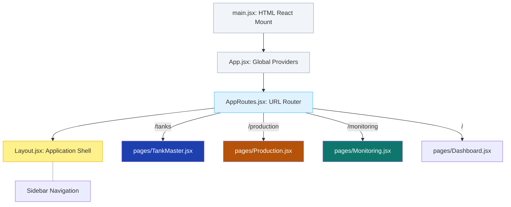
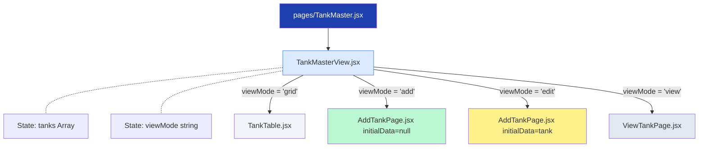
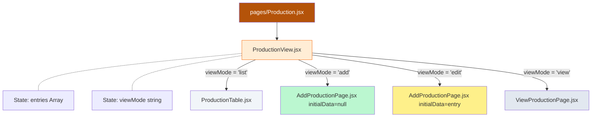
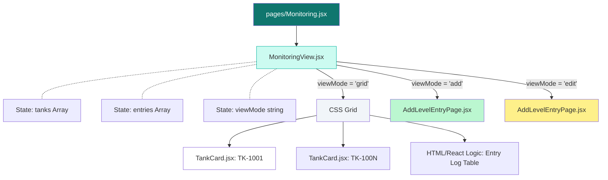

# GasTrack Pro — Component Architecture Visual Map

This document visually maps how every single React component mounts in the application and what states are managed.

## Application Root Mounting (App.jsx & Routing)

The entry point of the app forces a top-level layout wrapper and resolves the URL to inject a Feature Page.

___

## Tank Master Module (`/tanks`)

The Tank Master tracks bulk gas storage. `TankMasterView.jsx` acts as the traffic controller, holding the state of the table data and dynamically switching the mounted child based on `viewMode`.

___

## Gas Production Module (`/production`)

The Production system operates almost identically to Tank Master, using a `_mode` flag string (`save` vs `post`) in the data object to determine if editing is allowed.

___

## Tank Monitoring Module (`/monitoring`)

The Monitoring system is unique. Instead of a standard table, the default view is a responsive grid of `<TankCard>` elements summarizing capacity, with an Entry Log history table below it.

___

## Component Architecture Principles

### 1. The "Traffic Cop" Pattern (Conditional Rendering)
Instead of relying on heavy page routing (which would refresh the dashboard shell unnecessarily), each feature's `View.jsx` acts as a pure state machine:
- It tracks `viewMode`. 
- Depending on the active mode string, it physically unmounts the current child (e.g., table) and mounts the incoming child (e.g., editing form).

### 2. Form Reusability (Prop Drilling)
Forms are **never duplicated**. Whether creating a new Tank or Editing an existing one, the application uses `<AddTankPage>`.
- If `initialData` evaluates to a null value, the form loads empty fields.
- If `initialData` receives an active Object, it injects those properties directly into React State, forcing the component to mount in "Edit Mode".

### 3. The Lock (`_mode = "post"`) System 
When updating data on any form, a user can trigger either the `handleSave("save")` or `handleSave("post")` callbacks.
- The `View.jsx` component receives the updated data object.
- The Object is destructured to add `_mode: "post"`.
- Any component interpreting `_mode: "post"` will strictly conditionally hide the `<button>` tags required to open the Edit screen!
